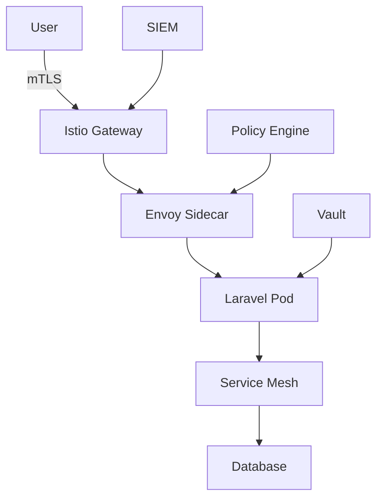

## EKS DevOps Enterprise Implementation

## Project Structure

```
.
├── README.md
├── .github/
│   ├── workflows/
│   │   ├── main.yml
│   │   ├── security-scan.yml
│   │   ├── cost-analysis.yml
│   │   └── disaster-recovery.yml
│   ├── CODEOWNERS
│   └── dependabot.yml
├── terraform/
│   ├── environments/
│   │   ├── dev/
│   │   ├── staging/
│   │   └── prod/
│   ├── modules/
│   │   ├── eks-platform/
│   │   ├── observability/
│   │   ├── security/
│   │   ├── service-mesh/
│   │   └── data-platform/
│   ├── global/
│   │   └── backend.tf
│   └── terragrunt.hcl
├── kubernetes/
│   ├── base/
│   ├── overlays/
│   │   ├── dev/
│   │   ├── staging/
│   │   └── prod/
│   └── argocd/
├── helm/
│   ├── charts/
│   │   ├── laravel-app/
│   │   ├── monitoring-stack/
│   │   └── security-stack/
│   └── releases/
├── docker/
│   ├── app/
│   │   ├── Dockerfile
│   │   └── Dockerfile.debug
│   ├── nginx/
│   └── scripts/
├── .devcontainer/
│   └── devcontainer.json
├── observability/
│   ├── prometheus/
│   ├── grafana/
│   ├── loki/
│   └── tempo/
├── security/
│   ├── policies/
│   ├── scanning/
│   └── vault/
├── scripts/
│   ├── bootstrap.sh
│   ├── disaster-recovery.sh
│   └── cost-optimization.sh
├── tests/
│   ├── unit/
│   ├── integration/
│   ├── e2e/
│   └── chaos/
└── docs/
    ├── architecture/
    ├── runbooks/
    └── adr/
```

# README.md

```markdown
# Laravel 10 Enterprise DevOps Platform

**Lead Engineer**: Munir Ahmed
**Email**: itsmunyrhere@gmail.com
**Architecture Version**: 2.0

> Enterprise-grade DevOps implementation featuring multi-cloud support, zero-trust security, and advanced observability

## 🏗️ Architecture Overview

This implementation represents a state-of-the-art DevOps platform designed for:
- **Multi-region deployments** with automatic failover
- **Zero-trust security architecture**
- **Full observability stack** with distributed tracing
- **Progressive delivery** with canary deployments
- **Cost optimization** through intelligent resource management
- **Compliance** (SOC2, HIPAA ready)

### Key Innovations

1. **Service Mesh Integration**: Istio-based traffic management with automatic mTLS
2. **GitOps Workflow**: ArgoCD for declarative deployments
3. **Multi-Cloud Ready**: Terraform modules support AWS, GCP, and Azure
4. **AI-Powered Monitoring**: Anomaly detection and predictive scaling
5. **Automated Disaster Recovery**: Cross-region backup and restore

## 🚀 Quick Start

### Prerequisites

```bash
# Install required tools
curl -sSL https://raw.githubusercontent.com/your-org/devops-toolkit/main/install.sh | bash

# Tools installed:
# - Docker 24.0+
# - Kubernetes 1.28+
# - Terraform 1.6+
# - Terragrunt 0.50+
# - ArgoCD CLI 2.9+
# - Helm 3.13+
# - AWS CLI v2
# - kubectl
# - kustomize
# - jq, yq
```

### Bootstrap Environment

```bash
# Clone repository
git clone https://github.com/your-org/laravel-devops-platform.git
cd laravel-devops-platform

# Initialize environment
./scripts/bootstrap.sh --environment dev --region us-east-1

# Verify setup
make verify
```

## 📊 Architecture Decisions

We follow Architecture Decision Records (ADRs) for tracking key decisions:

- [ADR-001](docs/adr/001-service-mesh.md): Istio for Service Mesh
- [ADR-002](docs/adr/002-gitops-argocd.md): ArgoCD for GitOps
- [ADR-003](docs/adr/003-multi-cloud-terraform.md): Multi-cloud Terraform Structure
- [ADR-004](docs/adr/004-zero-trust-security.md): Zero Trust Security Model

## 🔒 Security Architecture

### Zero Trust Implementation



### Security Features

- **mTLS Everywhere**: Automatic certificate rotation
- **Policy as Code**: OPA-based policy enforcement
- **Secret Management**: HashiCorp Vault integration
- **Runtime Protection**: Falco for threat detection
- **Compliance Scanning**: Automated CIS benchmark checks

## 🔍 Observability Stack

### Metrics, Logs, and Traces

```yaml
observability:
  metrics:
    prometheus:
      retention: 30d
      ha_mode: true
    thanos:
      object_storage: s3
      retention: 1y
  
  logs:
    loki:
      storage: s3
      retention: 90d
    elasticsearch:
      cluster_size: 3
  
  tracing:
    tempo:
      storage: s3
    jaeger:
      sampling_rate: 0.1
  
  visualization:
    grafana:
      dashboards:
        - kubernetes-overview
        - application-metrics
        - business-kpis
        - cost-analysis
```

## 🔄 CI/CD Pipeline

### GitHub Actions Workflow

```mermaid
graph LR
    A[Code Push] --> B[Lint & Test]
    B --> C[Security Scan]
    C --> D[Build & Push]
    D --> E[Deploy Dev]
    E --> F[Integration Tests]
    F --> G[Deploy Staging]
    G --> H[E2E Tests]
    H --> I[Manual Approval]
    I --> J[Canary Deploy]
    J --> K[Progressive Rollout]
    K --> L[Production]
```



### Progressive Delivery

```yaml
canary:
  stages:
    - weight: 5
      duration: 5m
      analysis:
        - error_rate < 1%
        - p99_latency < 500ms
    - weight: 25
      duration: 10m
    - weight: 50
      duration: 10m
    - weight: 100
```

## 🏗️ Infrastructure as Code

### Multi-Cloud Support

```hcl
# terraform/modules/compute/main.tf
module "provider_abstraction" {
  source = "./providers/${var.cloud_provider}"
  
  instance_config = {
    type = var.instance_type
    count = var.instance_count
    region = var.region
  }
}
```

## 🚦 Service Mesh Configuration

### Istio Traffic Management

```yaml
apiVersion: networking.istio.io/v1beta1
kind: VirtualService
metadata:
  name: laravel-app
spec:
  hosts:
    - laravel.example.com
  http:
    - match:
        - headers:
            x-version:
              exact: canary
      route:
        - destination:
            host: laravel-app
            subset: canary
    - route:
        - destination:
            host: laravel-app
            subset: stable
          weight: 100
```

## 💰 Cost Optimization

### Automated Cost Management

```python
# scripts/cost_optimization.py
class CostOptimizer:
    def analyze_unused_resources(self):
        unused_volumes = self.find_unused_ebs_volumes()
        idle_instances = self.find_idle_instances()
        return self.generate_recommendations(unused_volumes, idle_instances)
    
    def implement_spot_strategies(self):
        return self.optimize_spot_usage()
```

## 🔄 GitOps with ArgoCD

### Application Definition

```yaml
apiVersion: argoproj.io/v1alpha1
kind: Application
metadata:
  name: laravel-app
  namespace: argocd
spec:
  project: production
  source:
    repoURL: https://github.com/your-org/laravel-configs
    targetRevision: main
    path: kubernetes/overlays/prod
  destination:
    server: https://kubernetes.default.svc
    namespace: laravel-prod
  syncPolicy:
    automated:
      prune: true
      selfHeal: true
```

## 🚨 Disaster Recovery

### Multi-Region Setup

```hcl
module "primary_region" {
  source = "./modules/eks-platform"
  region = "us-east-1"
  
  disaster_recovery = {
    enabled = true
    backup_region = "us-west-2"
    rpo_minutes = 5
    rto_minutes = 15
  }
}
```

## 🔮 AI/ML Integration

### Predictive Scaling

```python
class PredictiveScaler:
    def predict_load(self, time_series_data):
        prediction = self.model.predict(time_series_data)
        self.scaling_gauge.set(prediction)
        return prediction
```

## 📈 Business Metrics Dashboard

### Custom Grafana Dashboards

```json
{
  "dashboard": {
    "title": "Laravel Business KPIs",
    "panels": [
      {
        "title": "Revenue per Hour",
        "targets": [
          {
            "expr": "sum(rate(order_total_amount[1h]))"
          }
        ]
      }
    ]
  }
}
```

## 🔄 Development Workflow

### Feature Branch Strategy

```bash
# Create feature branch
git checkout -b feature/JIRA-123-new-feature

# Develop with live preview
devcontainer up

# Run comprehensive tests
make test-all

# Create PR with automated checks
gh pr create --title "JIRA-123: New Feature"
```

## 📚 Documentation

### Available Guides

- [Architecture Overview](docs/architecture/system-design.md)
- [Security Guidelines](docs/security/guidelines.md)
- [Incident Response](docs/runbooks/incident-response.md)
- [Cost Management](docs/runbooks/cost-optimization.md)

## 🤝 Contributing

See [CONTRIBUTING.md](CONTRIBUTING.md) for our development process.

## 📄 License

This project is licensed under the MIT License - see [LICENSE](LICENSE) file.
```
